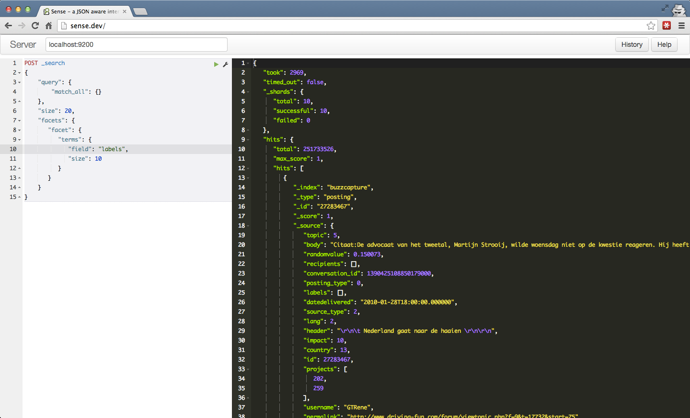
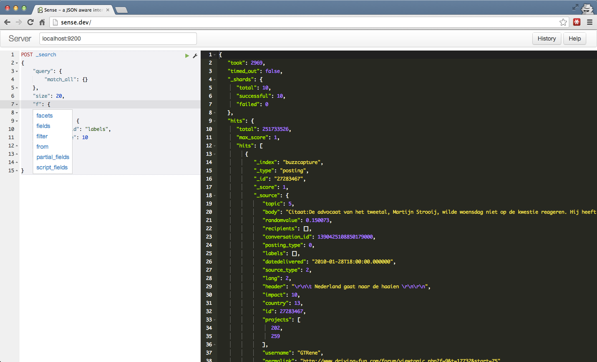
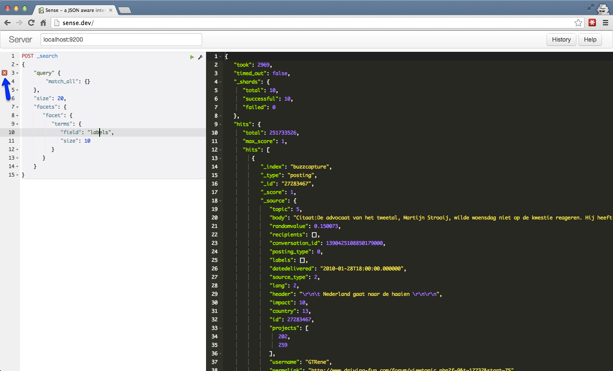

Sense
=====

A JSON aware, web based interface to ElasticSearch. Comes with handy machinary such as syntax highlighting, autocomplete, 
formatting and code folding.

Honesty first
-------------
This is an evening project which have gotten out of hand. It has rough egdge and probably bugs but I find it very usefull.
I hope you do too.

Installation
------------

In your elasticsearch installation folder, run:

    bin/plugin -install bleskes/sense
   
   

Screenshots
-----------

### Syntax highlighting

### Auto complete

### Broken JSON detection

